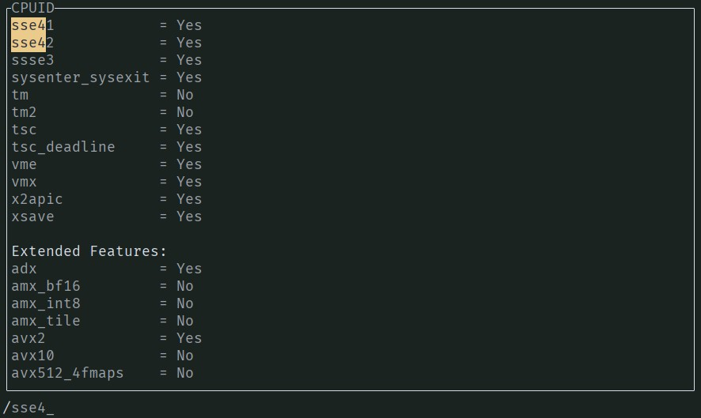
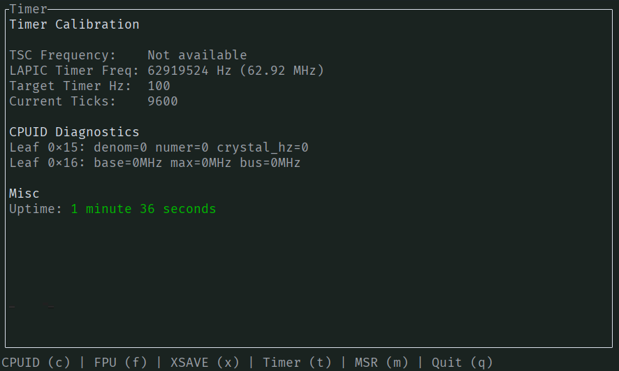

# CPU State TUI

Baremetal program to visualize x86_64 CPU state. Written in Rust with [bootloader-rs](github.com/rust-osdev/bootloader) and [ratatui](github.com/ratatui/ratatui).

Co-authored by Claude Opus 4.5 using GitHub's copilot-cli project.

## Build

It will create a bootable `bios.img`.

```sh
make
```

## Run

Spawn in QEMU w/ -accel KVM/MSHV. Only bios boot is supported for now.

```sh
make run
```

## Navigation

- `j` / `k`: Move down / up
- ctrl + `f` / `b`: Page down / up
- `gg` / `G`: Go to top / bottom
- `/` : Search
- `n` / `N`: Next / previous search result

## Screenshots

### Search in CPUID pane



### Timer pane


